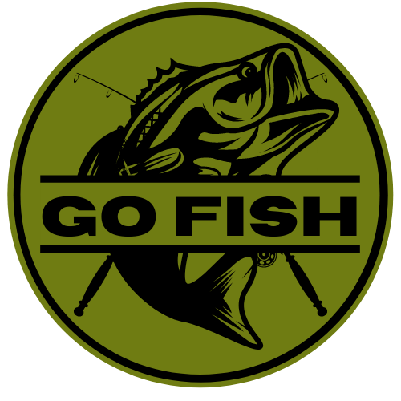

# Go Fish 

## Table of Contents

[Description](#description) [Installation](#installation) [Usage](#usage) [License](#license) [Preview](#preview) [Credits](#credits)

## Description
Go Fish is a content management system for beginning, intermediate, or avid fishing enthusiasts.  The homepage displays a newsfeed where users are able to post their latest thoughts across a wide range of topics, from hot fishing holes, to gear reviews, and even recipes for their favorite catches.  Posts will include the number of likes and comments below the main content.  

## Installation

No installation required! Visit us [here](https://INSERT_HEROKU_URL_HERE.com) to get started.  Happy angling!!!

## Usage

A visitor to the page can choose View Comments to expand the contents of that post's comments or View Post to show a single-post page with the comments expanded.  A search bar at the top right will return posts containing the a search term.  Returning users can login to unlock the new post, new comment, and like features.  If it's a visitors first time to the site, they will have to choose Sign Up to create a username, provide an email, and create a password.

## License
This project is covered by the [MIT License](https://opensource.org/licenses/MIT)

## Preview
The following image shows the homepage: 

## Credits
Contributors to this project were [Nick](https://github.com/norklas), [Matt](https://github.com/noreikam), and [Trey](https://github.com/JustTrey12) and [Ken](https://github.com/KennethHollis).

Technologies used included [Node.js](https://nodejs.org/en/), [Express](https://expressjs.com/), [MySQL](https://www.mysql.com/), [Seuelize](https://sequelize.org/v5/), [Handlebars](https://handlebarsjs.com/), [JavaScript](https://www.javascript.com/), [Canva](https://www.canva.com/q/pro/), [Passport](https://www.npmjs.com/package/passport) and [Heroku](https://dashboard.heroku.com/apps).